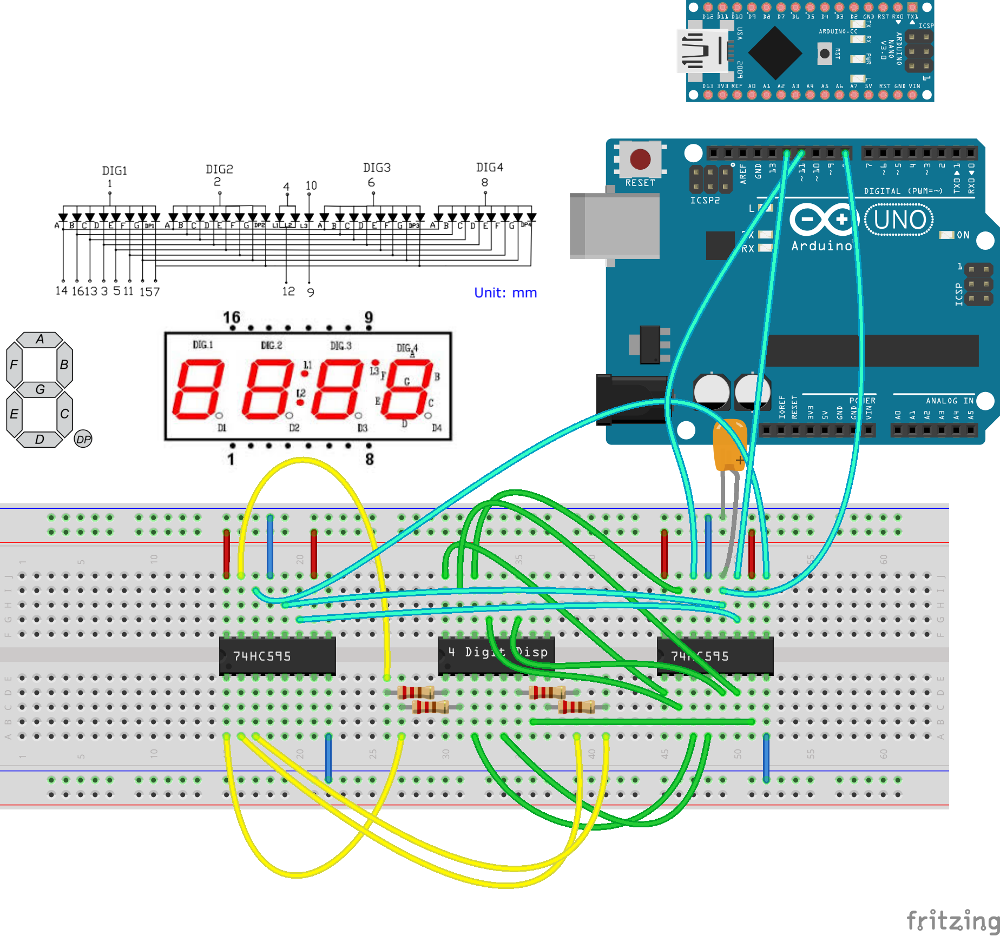

# ArduinoMusicNoteGuessingGame
The Arduino will play a note, and you must try to match the frequency.

Mark Chen

May 27 2019

This arduino circuit will run a little music game where a frequency is played from 2 octaves of the C Major Scale.
A note will be played, and the user can adjust the dial (potentiometer) to attempt to guess the frequency of the sound being played.
A 4 digit display will show the frequency number that the user wishes to enter as their guess.
When the button is pressed, the displayed freqency will be locked and compared to the correct frequency.
LEDs will display the accuracy of the player, in a format like a traditional traffic light display - red, amber, and green.

4 digit display

